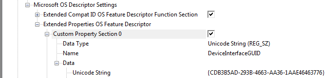

# CMSIS-DAP Firmware {#dap_firmware}

[TOC]

The CMSIS-DAP firmware implements the \ref mainpage "CMSIS-DAP concept". The firmware is provided in a source code in [**CMSIS-DAP GitHub repository**](https://github.com/ARM-software/CMSIS-DAP) with several reference implementations for popular debug units. The table below explains the directory structure.

Folders and Files                     | Description
:-------------------------------------|:-----------------------------------------------------------------------
📂 Firmware                           | Folder with CMSIS-DAP Firmware.
 ┣ 📄 Config/DAP_config.h             | CMSIS-DAP firmware configuration file. See \ref dap_config_io.
 ┣ 📂 Examples                        | CMSIS-DAP firmware adapted to various debug units. See \ref dap_fw_examples.
 ┣ 📂 Include                         | CMSIS-DAP firmware header file.
 ┣ 📂 Source                          | CMSIS-DAP firmware source code.
 ┣ 📂 Template                        | Interface templates for Keil MDK-Middleware.
 ┗ 📂 Validation                      | Validation project. See \ref dap_validate.

The implementation is composed of the following components:

 - CMSIS-DAP firmware that interfaces to JTAG or SWD pins using standard I/O pins of the Cortex-M device.
 - CMSIS-Driver USART that connects:
   - the UART of the Cortex-M device to the SWO output from the target.
   - an additional UART of the Cortex-M device to the UART from the target.
 - USB stack that interfaces to the USB port of the host computer using:
   - a custom class (for USB bulk endpoints),
   - the CDC ACM class to export USB COM Port.
 - The USB Device middleware may require CMSIS-RTOS and a CMSIS-Driver USB.

## Hardware requirements {#dap_hw_reqs}

The CMSIS-DAP firmware is designed for debug units that fulfill the following hardware requirements:

 - Cortex-M processor-based microcontroller.
 - CPU Clock: 48 MHz or higher; microcontroller must have a SYSTICK timer.
 - RAM: 8 KB or more.
 - Flash ROM: 16 KB or more.
 - Full-speed or High-speed USB Device peripheral.
 - 7 standard I/O pins for JTAG/SWD interface.
 - Optionally, 2 I/O pins for status LEDs.
 - Optionally, a UART to support SWO capturing (Rx pin connected to SWO).
 - Optionally, a UART to support an additional UART communication port (for printf debugging).

The figure below illustrates the hardware interfaces of a CMSIS-DAP debug adapter.


## Example implementations {#dap_fw_examples}

Reference implementations of CMSIS-DAP firmware are provided as source code with complete project files and may be used as a starting point for the firmware adapatation to a new debug unit. Following examples are provided:

Folders and Files                     | Description
:-------------------------------------|:-----------------------------------------------------------------------
📂 Firmware/Examples                  | Folder with example CMSIS-DAP firmware projects.
 ┣ 📂 LPC-Link2                       | CMSIS-DAP firmware adapted to the NXP LPC-Link2 debug unit.
 ┗ 📂 MCU-LINK                        | CMSIS-DAP firmware adapted to the NXP MCU-LINK debug unit.

In these examples the Keil MDK-Middleware USB stack is used. However, it is possible to use alternative USB stacks as well.

## Create firmware project {#dap_fw_prj}

To create CMSIS-DAP firmware that can be used on a different debug unit copy an existing firmware adaptation to a new folder. For example, copy the folder ` Firmware/Examples/MCU-LINK` to a folder called `/Firmware/MyDebugUnit`.

Following steps describe the adaptation of the CMSIS-DAP firmware to a new debug unit:
 1. \ref dap_config_mcu :  Select the microcontroller and replace the CMSIS-Core (Cortex-M) files.
 2. \ref dap_config_io : Adapt the I/O ports and specify other parameters for the debug unit.
 3. \ref dap_usart_swo : Optionally, you may add a CMSIS-Driver USART to interface to SWO.
 4. \ref dap_usart_com : Optionally, you may add a CMSIS-Driver USART to interface to UART communication port.
 5. \ref dap_config_usb : Adapt the USB peripheral to the microcontroller.
 6. \ref DAP_Vendor_gr : Optionally, you may add vendor specific commands to the debug unit.
 7. \ref dap_config_flash : Program the adapted firmware to the Flash ROM of the new debug unit.
 8. \ref dap_validate : Validate the CMSIS-DAP firmware of the new debug unit.

## Selecting target processor {#dap_config_mcu}

The CMSIS-DAP firmware is designed to execute on a debug unit that is using a Cortex-M processor-based microcontroller.

The following steps describe how to change the target microcontroller in the custom CMSIS-DAP firmware project:

 1. In the µVision IDE, open the project file `Firmware/MyDebugUnit/CMSIS_DAP.uvprojx`.
 2. Open the **Project - Options - Device** dialog and select the microcontroller of the new debug unit.
 4. Optionally, you may modify the project file **Target** name and the file **Abstract.txt** to reflect the new debug unit.


In Keil MDK, changing the microcontroller adds relevant software components for the new target. However, depending on the availability you may need to replace some components with custom implementations.


## Configuring I/O ports and debug unit {#dap_config_io}

The CMSIS-DAP firmware configuration file `DAP_config.h` provides the interface functions and configuration parameters for the hardware of the CMSIS-DAP debug unit. Refer to \ref DAP_ConfigIO_gr for detailed descriptions of available configuration options.

## Enabling SWO trace {#dap_usart_swo}

Optionally, you may add a CMSIS-Driver USART to interface to SWO.

A CMSIS-Driver USART can be used to capture the trace output on the SWO pin using a UART RX input on the microcontroller. UART Serial Wire Output (SWO) trace can be enabled and configured in the header `DAP_config.h`. \ref SWO_UART is used to enable the UART SWO and \ref SWO_UART_DRIVER is used to configure USART Driver instance number (Driver_USART#).

Refer to \ref DAP_Config_Debug_gr for more information.

## Enabling serial port {#dap_usart_com}

Optionally, you may add a CMSIS-Driver USART to interface to UART communication port.

A CMSIS-Driver USART can be used to receive data from the target and transmit data to the target using UART RX and TX pins on the microcontroller. The UART communication port can be enabled and configured in the header `DAP_config.h`. \ref DAP_UART is used to enable the UART communication port and \ref DAP_UART_DRIVER is used to configure USART Driver instance number (Driver_USART#).

Refer to \ref DAP_Config_Debug_gr for more information.

## Configuring USB peripheral {#dap_config_usb}

CMSIS-DAP firmware communicates via USB with the host computer. The USB communication is implemented via Keil MDK-Middleware components that access the USB peripheral of the microcontroller.

The CMSIS-DAP v2 firmware uses \ref dap_bulk_usb "USB bulk endpoints" that provide high-speed communication. In addition, \ref dap_usb_cdc is used to enable USB COM port.

For the USB interface it is important to provide correct configuration information for the USB peripheral as described in this section.

The following steps describe how to change and configure the USB peripheral in the CMSIS-DAP firmware project:

 1. In the **Project Window**, the group **USB** contains USB interface with the relevant configuration files.
 2. Open the file `usb_config_0.c` in the editor and select **Configuration Wizard** as edit mode; then change the following settings:
  - **USB Device 0 - High-speed**: enable this option only for a high-speed USB peripheral; disable for full-speed USB.
  - Update **Device Settings - Vendor ID** which is provided by the [USB Implementers Forum](https://www.usb.org/getting-vendor-id).
  - Update **Device Settings - Product ID** to provide a unique identification for the debug unit.
  - Update **Device Settings - Device Release Number** to indicate the revision of the adaptation.
  - Update **String Settings - Manufacturer String** to reflect the vendor of the debug unit. This setting should match the **Vendor ID**.
  - Update **String Settings - Product String** to indicate the debug unit. Note that "CMSIS-DAP" must be part of that string to allow identification by debuggers (or part of interface string for USB composite device).
  - Optionally each debug unit may provide a unique **Serial Number String**. If the **String Settings - Serial Number String** is not provided, only one debug unit can be connected at the same time to a host computer since it is impossible to identify multiple debug units.

> **Note**
>  - The USB Device setting high-speed / full-speed USB must be reflected in the `DAP_config.h` file.
>  - The **String Settings - Product String** must contain "CMSIS-DAP" somewhere in the string. This is used by the debuggers to identify a CMSIS-DAP compliant debug unit that is connected to a host computer.


### Communication via USB bulk endpoints {#dap_bulk_usb}

CMSIS-DAP v2 uses USB bulk endpoints. Optionally, support for streaming SWO trace is provided via an additional USB endpoint.

This configuration requires custom class support with the interface setting:

 - Class Code: `0xFF` (Vendor specific)
 - Subclass: `0x00`
 - Protocol code: `0x00`

> **Note**
> - This interface enables also [WebUSB](https://wicg.github.io/webusb/) technology that is used in web browsers to connect to a debug adapter connected to your PC.

Depending on the configuration, it uses the following USB endpoints which should be configured in the interface descriptor in this order:

 - Endpoint 1: Bulk Out – used for commands received from host PC.
 - Endpoint 2: Bulk In – used for responses send to host PC.
 - Endpoint 3: Bulk In (optional) – used for streaming SWO trace (if enabled with \ref SWO_STREAM).


> **Note**
> - These settings allow support in Windows (8 and above), Mac OS, and Linux without further drivers. Some additional settings are required to automatically install CMSIS-DAP enabled debug adapters in these operating systems.

**Additional settings for Microsoft Windows**

For automatic installation of a CMSIS-DAP v2 enabled debug adapter in Windows, use the following WinUSB GUID in the USB custom class:

```
{CDB3B5AD-293B-4663-AA36-1AAE46463776}
```

The picture below shows the WinUSB GIUD configuration of the USB custom class:



\anchor wininf
**USB Driver**

Windows 8 and above does not require a WinUSB driver provided that the USB firmware stack supports Microsoft descriptors.

CMSIS-DAP v2 device should be configured as WCID (Windows Compatible ID) device which provides extra information to a Windows system to facilitate automated driver installation.

Also see \ref dap_drv_install for additional information.

### Communication Device Class {#dap_usb_cdc}

CMSIS-DAP v2 supports also a UART communication port optionally routed to a USB COM port which is implemented by a USB Communication Device Class (CDC) device.

The picture below shows the configuration of the USB CDC class.


## Programming into debug unit {#dap_config_flash}

Once the CMSIS-DAP firmware is configured and built, it needs to be programmed into the Flash ROM of the new debug unit.

Keil MDK provides Flash algorithms for many Cortex-M based microcontrollers and therefore you may use the Flash programming facilities that are provide in µVision. Once Flash programming is configured, you may use the µVision menu item **Flash - Download**.


