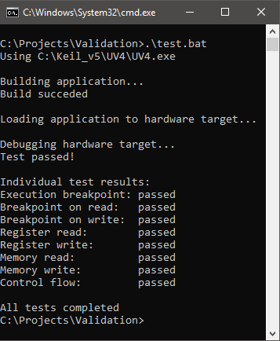

# Validate the debug unit operation {#dap_validate}

A validation project for Arm Keil MDK is provided in the folder `/Firmware/Validation/MDK5`.

The `Validation.uvprojx` project contains a simple application that needs to be adapted to the target hardware connected to the debug unit. Once the adaptation is complete, you may open a Command window and call the batch file `test.bat` (optionally with the path to the µVision executable):

The batch file will create a `test_results.txt` and `test.log` file in the project directory.
