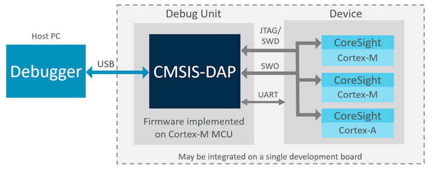

# CMSIS-DAP

The branch *main* of this GitHub repository contains  **CMSIS-DAP** - a protocol specification and a firmware implementation that enables standardized access to Arm CoreSight Debug Access Port ([DAP](https://developer.arm.com/documentation/102585/0000/what-is-a-debug-access-port)) for debugging embedded software programs.

The figure below illustrates the concept:



The [CMSIS-DAP documentation](https://arm-software.github.io/CMSIS-DAP) describes the CMSIS-DAP firmware, provides the guidelines for its adaptation and documents the CMSIS-DAP USB commands.

## Directory Structure

```txt
  📦
  ┣ 📂 Documentation    Folder with sources of CMSIS-DAP documenation
  ┣ 📂 Firmware         Folder with CMSIS-DAP firmware, examples and validation projects
  ┣ 📄 LICENSE          License Agreement (Apache 2.0)
  ┗ 📄 README.md        Repository description
```

## License

CMSIS-DAP in this repository is licensed under Apache-2.0.

## Contributions and Pull Requests

Contributions are accepted under Apache-2.0. Only submit contributions where you have authored all of the code.

### Issues and Labels

Please feel free to raise an [issue on GitHub](https://github.com/ARM-software/CMSIS-DAP/issues)
to report misbehavior (i.e. bugs) or start discussions about enhancements. This is your best way to interact directly with the maintenance team and the community.

We encourage you to append implementation suggestions as this helps to decrease the workload of the very limited maintenance team.

We will be monitoring and responding to issues as best we can.

Please attempt to avoid filing duplicates of open or closed items when possible.
In the spirit of openness we will be tagging issues with the following:

 - **bug** – We consider this issue to be a bug that will be investigated.

 - **wontfix** - We appreciate this issue but decided not to change the current behavior.

 - **enhancement** – Denotes something that will be implemented soon.

 - **future** - Denotes something not yet schedule for implementation.

 - **out-of-scope** - We consider this issue loosely related to CMSIS-DAP. It might by implemented outside of it. Let us know about your work.

 - **question** – We have further questions to this issue. Please review and provide feedback.

 - **documentation** - This issue is a documentation flaw that will be improved in future.

 - **review** - This issue is under review. Please be patient.

 - **DONE** - We consider this issue as resolved - please review and close it. In case of no further activity this issues will be closed after a week.

 - **duplicate** - This issue is already addressed elsewhere, see comment with provided references.

 - **Important Information** - We provide essential informations regarding planned or resolved major enhancements.

---

_Copyright (c) 2019-2023, ARM Limited and Contributors. All rights reserved._
